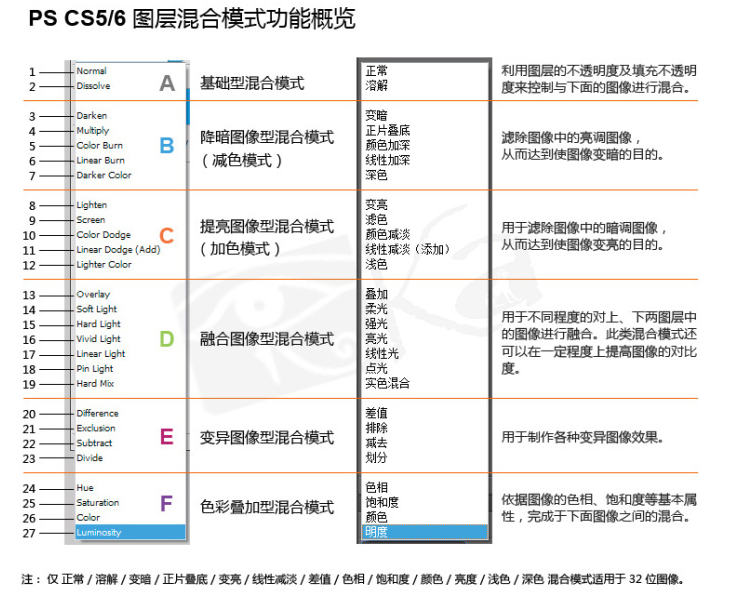

<h3>1、基本使用说明：</h3>

<h4>1.1、可取值：</h4>

对应的可以参考PS相应的模式， 有一个人写的PS教程 [Photoshop中高级进阶系列之一——图层混合模式原理](http://www.zcool.com.cn/article/ZMzcyNzY=.html)

计算公式基于上面而写，原文有部分是错的。

```
{
  mix-blend-mode: normal;         // 正常（默认值，没有任何改变）
  
  /* 以下是为了变暗（减色模式） */  

  mix-blend-mode: multiply;       // 正片叠底，C = A * B / 255，效果是会比两个更暗
  mix-blend-mode: darken;         // 变暗，C = Min(A,B)，即取每一位偏小的值组合成 C 的 rgb 值
  mix-blend-mode: color-burn;     // 颜色加深，C = A - (A反相 * B反相) / B，解构为：255 * (A + B - 255) / B。有可能某个值小于0，那么则取0
  
  /* 以下是为了变亮（加色模式） */  

  mix-blend-mode: lighten;        // 变亮，C = Max(A,B)，取两个值里高的那个
  mix-blend-mode: screen;         // 滤色，C = 255 - (A反相 * B反相） / 255，就是变亮咯
  mix-blend-mode: color-dodge;    // 颜色减淡，C = A + A * B / B反相（原文写的是 A - A*B/B，验证后发现应该是相加），因为相加肯定也是变量
  
  /* 融合图像型混合模式 */
  
  mix-blend-mode: overlay;        // 叠加，A<=128， C=A*B/128，这个相当于0.x * B ；A>128，C=255-(A反相*B反相)/128，这个相当于255 - 0.x * B反相
  mix-blend-mode: hard-light;     // 强光，B<=128， C=A*B/128，相当于0.x*A（比A小）；B>128，C=255-(A反相*B反相)/128。强光和叠加的区别的在于，一个根据上层计算，一个根据下层计算
  mix-blend-mode: soft-light;     // 柔光
  
  /* 变异图像型混合模式 */

  mix-blend-mode: difference;     // 差值，C = |A-B|，即取A-B的绝对值（原文这里是相加，是错的）
  mix-blend-mode: exclusion;      // 排除，C = A + B - A*B/128
  
  /* 色彩叠加型混合模式 */
  
  mix-blend-mode: hue;            // 色相
  mix-blend-mode: color;          // 颜色
  mix-blend-mode: saturation;     // 饱和度
  
  /* 其他 */
  
  mix-blend-mode: luminosity;     // 亮度，推测这个可能是色彩叠加型的【明度】
  mix-blend-mode: initial;
  mix-blend-mode: inherit;
  mix-blend-mode: unset;
}
```

注意，这里的值指 ``rgb`` 值。

假如设置为 rgba 值，例如：``background-color: rgba(200, 200, 200, .5);``，那么这个相当于 ``background-color: rgb(227, 227, 227);``，就是用后面这个值来计算。


<h4>1.2、用于上层DOM元素</h4>

假如我们的 html 结构如下：

```
<div id="box">
    <div class="a"></div>
    <div class="b"></div>
</div>
```

默认情况下，第二个子标签 ``<div class="b"></div>`` 会叠加于第一个子标签 ``<div class="a"></div>`` 之上。

那么，我们的 ``mix-blend-mode`` 属性就应该设置给第二个子元素。

假如第一个子元素设置了 ``z-index`` 并使其叠加与第二个子元素上，那么这个属性就应该设置给第一个子元素。

总而言之，用于更上面的那一个子元素。

<h4>1.3、基本概念</h4>

>反相

假如 A 的颜色为 ``rgb(255, 0, 0)``，那么 A 的反相就是 ``rgb(0, 255, 255)``

> 公式计算

例如计算公式是：``C = A * B / 255``，那么指 A 的 rgb 三色的每一位，都要去和 B 的 rgb 三色的对应每一位，执行这个计算公式，才会获得 C 的 rgb 三色的对应的每一位。

例如：

```
A : rgb(0,   50,  100)
B : rgb(150, 200, 250)
         0   50   100
         *    *    *
        150  200  250
         /    /    /
        255  255  255
         =    =    =
         0   39.2 98.0
C : rgb(0,   39,  98)
```

> 小于0的结果

如果结果小于 0 ，则取 0。依次类推，如果可能大于255，那么会取255

> A 和 B

下方的颜色为 A，上方的颜色为 B。一般来说，B，即上方的是 ``mix-blend-mode`` 这个属性生效的那个。

