<h3>0、前注</h3>

[英文原文](https://raygun.com/javascript-debugging-tips)

本文基于[译文](https://www.oschina.net/translate/javascript-debugging-tips)，在原有基础上进行<b><i>增强</i></b>，根据我个人了解，额外加了很多内容。

默认是基于chrome来进行调试的，如果是其他浏览器，不一定能支持（特别是IE）

<h3>1、debugger</h3>

``debugger`` 的效果是当浏览器执行到这一段语句的时候，自动被断点。

你可以在控制台输入以下测试代码：

```
console.log('before')
debugger
console.log('after')
```

新人最爱用``alert()``来显示内容，进行调试。

但毫无疑问，使用``debugger``比``alert()``更专业。

并且，可以通过命令来统一管理代码：

```
function debug (arg) {
    let allDebugger = false    // 为true时，会所有都被断点
    // 不能写成 true ? debugger : null
    if (arg || allDebugger)
        debugger
}

console.log('1')
debug(1)
console.log('2')
debug(0)
console.log('3')
```

当传参且为true的时候，会被debugger，否则不会debugger。

如果``allDebugger``为``true``，那么所有都会被断点。

当然，个人只建议在调试的时候这么写，调试完后还是应该删除，毕竟太丑。

<h3>2、把object或array输出为表格</h3>

>console.table(args)

只对第一个参数生效（后面的无效）

先上代码：

```
let foo = {
    a: 1,
    b: 2,
    c: function () {
        console.log('c')
    }
}
let bar = [
    {
        a: 1, b: 2,
        c: function () {
            console.log('c')
        }
    },
    {
        a: 3, b: 4,
        c: function () {
            console.log('c')
        }
    },
    3
]
console.table(foo)
console.table(bar)
```

都是生成表格，但是对对象和数组的生成方式有所区别：

<b>对象</b>

对于对象，生成表格的时候，对象的key作为第一列，值作为第二列。

假如对象的某个属性的值是函数，那么：

* 第二列``Value``为空；
* 第三列``length``是参数的个数（``fn.length``的值）；
* 第四列``name``是函数名；
* 第五列``arguments``（因为只有调用时这个才有值，所以一般都是null）；
* 第六列``caller``（一般也为null）；
* 第七列``prototype``（显示不出来，也点不开）

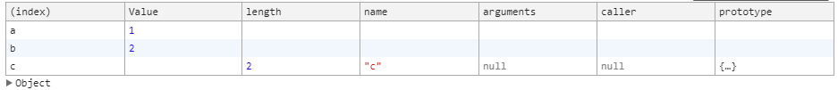

<b>不能显示的：</b>

1. 单独对函数使用``console.table()``是没用的；
2. 对``class``类也无效（除非是类的实例）；
3. ``writable``, ``enumerable``, ``configurable``这三个属性不影响显示；
4. 不能显示原型链上的内容，如代码：

```
function Test () {
    this.a = 1
}

Test.prototype.b = 2
console.table(new Test())
```

只能显示a的值，不能显示b的值。

<b>数组</b>

1. 数组的索引作为第一列（``(index)``）的值；
2. 数组元素如果是非对象，那么有一列为``Value``的值为该元素的值；
3. 数组元素如果是对象，那么对象的key为一列，value为该列；

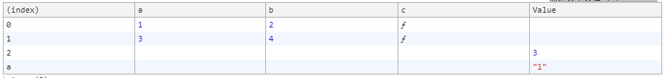

<h3>3、响应式调试</h3>

玩移动端H5开发的，估计没人不知道这个吧？

按下F12（win版，mac的话自己打开开发者工具）。如下图：

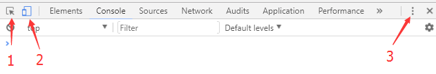

然后在调试窗口的左上角点击【2】指向的地方，就会打开响应式调试模式。

然后会在浏览器显示区域的上方出现以下内容：

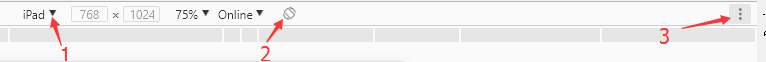

上图：

1. 点击【1】区域，可以适配不同的机型，不过比较遗憾的是没有比较新的机型，我目前版本的chrome最新的是iPhone6 plus；
2. 点击【2】区域，可以切换横屏竖屏；
3. 点击【3】区域，有显示手机外壳的，有拍照的，还有显示DPI的；

然后我们再看回第一个图


点击：

1. 点击区域【1】，然后可以鼠标移动到HTML元素上，再点击一下，可以自动选中那个HTML元素，适合分析DOM结构；
2. 点击区域【3】，在下拉弹窗的【Dock side】选项，可以切换调试窗所在位置，比如【靠左】【靠右】【靠下】【独立窗口】。双屏强烈推荐【独立窗口】；
3. 其他的略略略。

<h3>4、显示你最近5次点击的DOM</h3>

在控制台的【Elements】，可以显示DOM树，然后你点击一个html元素，又点了另外一个。这个时候想知道你之前点击的记录怎么办？

在控制台输入：

```
$0    // 表示最近一次点击的，输出的是DOM
$1    // 表示是比最近一次远一次的那个DOM
```

从``$0``一直到``$4``，可以记录最近5次点击。

不过个人感觉，这个没啥用。

<h3>5、获取时间段</h3>

>console.time(flags)

>console.timeEnd(flags)

这2个是成对出现的，参数表示标识（因为可能同时出现多个）。

时间不一定完全相等于你预期的时间，例如：

```
console.time('1')
setTimeout(() => {
    console.timeEnd('1')
}, 1000)
// 1000.459228515625ms
```

以上就是还额外多出来了0.459ms，这个时间可以用来参考估计某些代码执行的时间。

但缺点是，这个console.timeEnd没有返回值，所以你不能用变量来存下来（所以自己new Date()来计算时间差吧）；

另外注意，不能连续两个参数一样的console.timeEnd()，第二个的输出时间会是0ms。

<h3>6、显示堆栈调用</h3>

>console.trace(flags)

个人感觉这个用的也比较少。

原因在于如果需要捕捉堆栈，一般是出错的时候，但出错的时候抛错会自动显示堆栈。

<b>使用场景：</b>

在你发现有一个函数``fn1``被执行，但不能确定是谁调用了``fn1``；

或者``fn1``你预期只执行了一次，但实际上却发现执行了多次；

那么可以使用这个来分析。

使用示例：

```
function fn1 () {
    console.trace('fn1')
}

function fn2 () {
    fn1()
}

function fn3 () {
    fn2()
}

function fn4 () {
    fn1()
}

fn3()
fn4()
```

输出：

```
// 注释说明：fn3执行时的调用栈
fn1 @ 新建文本文档 (4).html:13
fn2 @ 新建文本文档 (4).html:17
fn3 @ 新建文本文档 (4).html:21
(anonymous) @ 新建文本文档 (4).html:28


// 注释说明：fn4执行时的调用栈
fn1 @ 新建文本文档 (4).html:13
fn4 @ 新建文本文档 (4).html:25
(anonymous) @ 新建文本文档 (4).html:29
```

<h3>7、格式化代码</h3>

我们在使用webpack打包的时候，一般会将代码压缩混淆。

好处是可以减少代码体积，但坏处是如果打包后报错（比如在测试环境），通过点击console的堆栈跳到代码处，会发现一堆代码无换行杂糅一起，基本无法调试。

解决办法chrome浏览器已经提供了，以[阿里巴巴的矢量图标库](http://www.iconfont.cn/)为例。

首先打开控制台，进入以下页面（进入方法已经用箭头标注）。

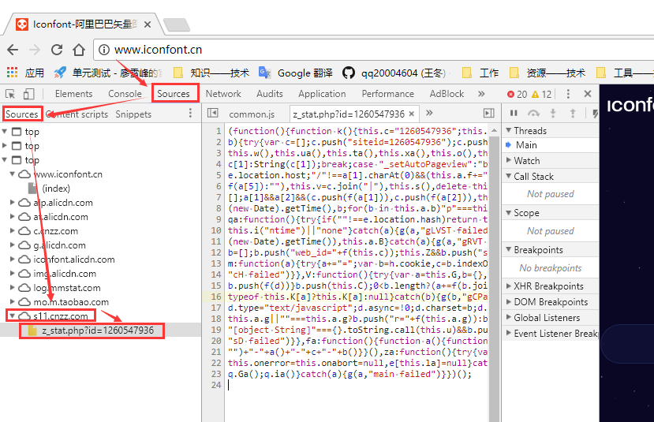

会发现中间区域的代码明显是压缩混淆之后的。

格式化代码很简单，如图箭头指向的地方，点一下：

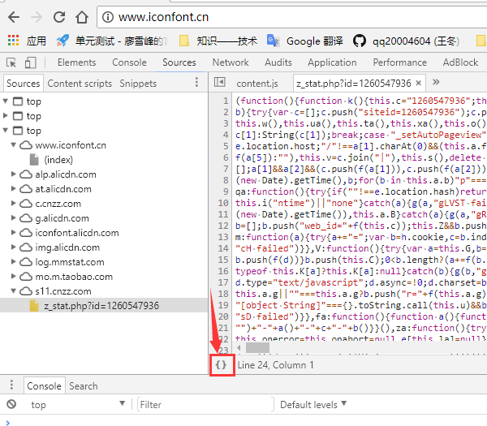

然后原本的js文件被一个文件后加了``:formatted``的文件所替代，代码行数从23行变成了600多行如下图：

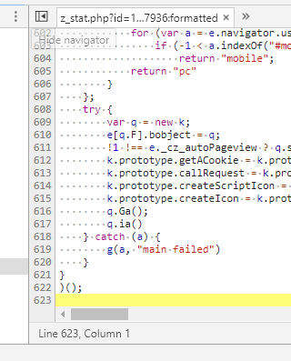

这个文件替代了原文件。

点击console的报错，或者在这里打断点，都是可以正常生效的。

建议自己试试，试完后理解起来很简单。

<h3>8、断点某函数</h3>

控制台输入：

> debug(函数名)

效果：在执行某个函数的时候，自动触发断点。

但这个其实不实用，原因有几点：

1. 如果某个函数在页面刷新后就执行，而不是例如点击按钮后执行，那么是基本用不到的。理由是执行这个命令后，再刷新页面，之前的输入无效（而刷新后立即执行的话，执行速度太快了）；
2. 现在通行的是混淆打包编译，在局部作用域内，在控制台，基本是没办法访问到这个函数的。

示例代码：

```
<script>
    function test () {
        console.log('test')
        let foo = function () {
            console.log('foo')
        }
        foo()
    }

    test()
</script>
<button onclick="test()">点击执行test</button>
```

1. 输入``debug(test)``，再刷新页面，调试不会生效；
2. 输入``debug(test)``，点击按钮，会触发调试；
3. 输入``debug(foo)``，会报错``foo is not defined``；
4. 如果想在执行foo的时候生效，代码需要如下改写：

```
<script>
    function test () {
        this.foo = function foo () {
            console.log('foo')
        }
        this.foo()
    }

    let bar = new test()
</script>
<button onclick="test()">点击执行test</button>
```

输入``debug(bar.foo)``，然后点击按钮，会触发断点。

所以还是推荐打``debugger``来进行指定代码的调试。

<h3>9、调试跳过某些文件</h3>

简单来说，就是指调试的时候，如果需要进入某个js文件，那么不再进入，而是``Sources``面板保持在在进入之前的位置和离开该文件后的位置。

举个简单的例子，当我们调试需要调用jQuery的代码时，由于jQuery代码一般是压缩混淆后的最小化代码，阅读困难，所以进入其代码内往往是没有意义的。

那么我们就可以通过这个办法让调试器在执行jQuery源码的时候，面板不进入（当然，实际还是在执行的），停留在进入之前的js文件。

<b>步骤说明：</b>

0、原文的方法，在我实测的时候，不可行，如果有人可以重现原文方法，请联系我的QQ：20004604，我会对本文进行订正；

0.5、建立2个文件，一个html（名字随便起），一个js文件（我这里随便起了一个``2.js``的名字）；

1、打开Source面板，右键js文件，复制文件链接（如下图）：

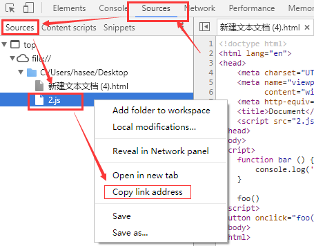

2、打开settings面板，如图：

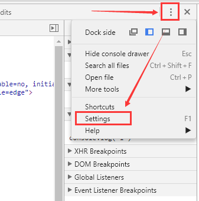

3、在settings面板内，如下操作：

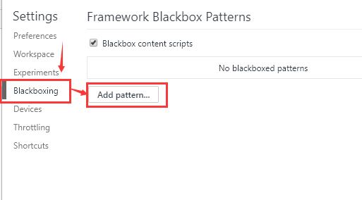

4、然后将之前复制的链接粘贴进去，点击【add】按钮：

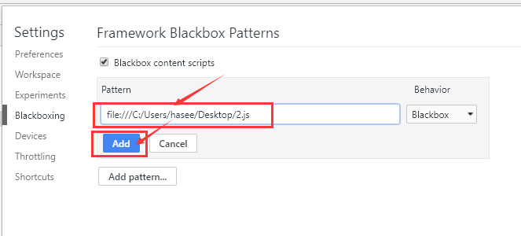

5、两个文件的内容如下：

```
// html文件
<!doctype html>
<html lang="en">
<head>
    <script src="2.js"></script>
</head>
<body>
<script>
    function bar () {
        console.log('bar')
    }

    foo()
</script>
<button onclick="foo()">点击执行foo</button>
</body>
</html>

// 2.js
function foo () {
    console.log('foo')
    debugger
    bar()
}
```

会发现``2.js``中的debugger是无效的。但是如果给``2.js``文件打断点，执行``foo()``或者点击按钮执行``foo()``时，断点会停留在html文件中，不会切换到js文件。

<h3>10、给console上色</h3>

示例：

```
console.log('%c%s', 'color:red', '红色字体')
```

这个在Python等语言里有，如果没接触过类似语法可能比较难理解。建议大家先复制以上代码到控制台看看效果。

简单来说，有点类似``str.replace()``的替换。

1. ``%c``，被认为是样式描述符，如果输入``color:red``，那么console的结果会被变为红色；
2. ``%s``，被认为是字符串，因此显示的文字是``红色字体``；
3. ``console.log``一共有三个参数，第一个是显示内容，有两个``%``运算符，第二个参数会被匹配到第一个``%``运算符，第三个参数会被匹配到第二个``%``运算符；

再举几个例子：

```
console.log('第一个字符串：%s，第二个字符串%s', 'foo', 'bar')
// 第一个字符串：foo，第二个字符串bar

console.log('第一个字符串：%s，第二个字符串%s', 'foo')
// 第一个字符串：foo，第二个字符串%s

console.log('第一个字符串：%s，第二个字符串%s', 'foo', 'bar', 'baz')
// 第一个字符串：foo，第二个字符串bar baz
```

1. 第一个的解释：``%``运算符可以直接和普通字符串拼接；
2. 第二个的解释：没有可匹配的参数时，``%``运算符会被认为是普通字符串（即``%s``）；
3. 第三个的解释：多出来的那个参数，之所以这么显示，是因为``console.log('bar', 'baz')``这样的原因；

<br>
<b>``%``运算符不完全解释；</b>

<table>
    <tr>
        <td>运算符</td>
        <td>匹配要求</td>
        <td>效果</td>
        <td>和要求不匹配时效果</td>
    </tr>
    <tr>
        <td>%c</td>
        <td>对应css样式</td>
        <td>用css样式修饰log（部分css无效，比如height和动画）</td>
        <td>错误的样式不生效，不影响其他正常的</td>
    </tr>
    <tr>
        <td>%s</td>
        <td>字符串</td>
        <td>将字符串替换到该位置</td>
        <td>正常显示</td>
    </tr>
    <tr>
        <td>%d</td>
        <td>数字（必须number类型）</td>
        <td>格式化为整数显示</td>
        <td>非number类型则NaN（包括'123'这样的字符串）</td>
    </tr>
    <tr>
        <td>%f</td>
        <td>浮点数（必须number类型）</td>
        <td>可以显示浮点数（但类似%1f只显示一位小数的设置无效）</td>
        <td>非number类型则NaN</td>
    </tr>
</table>

示例代码：

```
console.log('%c效果展示', 'font-size:100px;color:red;border:10px solid green;border-radius:30px;')
console.log('%s%s%s', '---', '效果展示', '---')
console.log('整数：%d', 123.45)
console.log('浮点数：%f', 123.45)
```

<h3>11、当某函数被调用时，提示和显示参数</h3>

这个和【断点某函数】存在同样的问题，你必须首先在控制台拿到该函数，才能实现，如果拿不到，或者很复杂的话，那么就特别不实用了。

示例代码（将这个直接输入到下面）：

```
function foo (a, b, c) {
    console.log(arguments)
}

monitor(foo)
foo(1, 2)
```

效果如图：

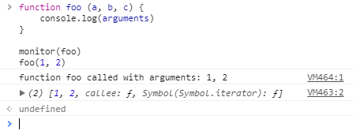

<h3>12、控制台专用的类jQuery选择器</h3>

jQuery的美元符选择器很好用，但如果没引用jQuery的话，做起来就很麻烦。

但浏览器的控制台自带类似jQuery的选择器语法，可以拿取DOM。

> $(css-selector)    // 返回单个DOM元素
<br>
> $$(css-selector)    // 返回数组

示例代码：

```
// html文件
<!doctype html>
<html lang="en">
<body>
<div id="foo"></div>
<div class="bar"></div>
</body>
</html>

// 控制台输入
$("#foo")
$$("#foo")
$(".bar")
$$(".bar")
```

效果如下图：

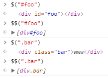

注意，可以理解为``document.querySelector()``和``document.querySelectorAll()``，但是返回数组的那个不一样。

因为``$$()``返回的是``[object Array]``，而``document.querySelectorAll()``返回的是``[object NodeList]``。

不过这个好像也没什么意义喔。

<h3>13、浏览器端编辑ajax请求</h3>

略略略，chrome貌似不行。

<h3>14、DOM被修改时自动断点</h3>

前端很多时候就是玩DOM，所以有时候我们需要关心DOM什么时候被改变（移除），或者修改。

先上HTML代码：

```
<!doctype html>
<html lang="en">
<body>
<script>
    function remove () {
        document.querySelector('.bar').remove()
        console.log('remove')
    }
</script>
<button id="foo" onclick="remove()">移除bar</button>
<div class="bar">bar</div>
</body>
</html>
```

然后如图做：

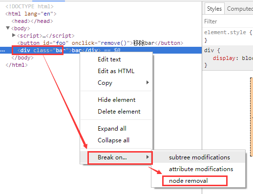

这个的效果就是当DOM被移除时，自动断点，且断点位置是DOM移除时的那一行代码（移除前最后一步）。

<b>需要控制台保持在``Elements``标签下才可触发断点！</b>

点击按钮移除，会发现自动触发断点（注意右边，bar这个HTML元素还在）：

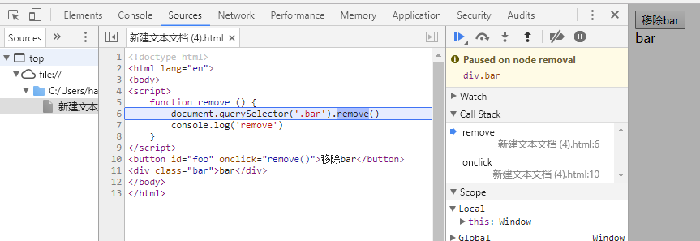

在``Break on...``的三个选项中：

1、第一个是DOM树改变，如下代码，当``#bar``添加了一个新的子元素（包括孙元素）时，或者子元素被移除时，就会触发断点：

```
<!doctype html>
<html lang="en">
<body>
<script>
    function add () {
        let DOM = document.createElement('a')
        DOM.innerHTML = '123'
        document.querySelector('#baz').appendChild(DOM)
    }
</script>
<button id="foo" onclick="add()">添加一个孙标签</button>
<div id="bar">
    <div id="baz"></div>
</div>
</body>
</html>
```

注意，当前DOM被移除时<b>不会触发这一个事件</b>

2、第二个是：当DOM属性更改，自动触发断点。

例如添加了一个class呀，之类之类的，都可以触发，代码如下：

```
<!doctype html>
<html lang="en">
<body>
<script>
    function add () {
        document.querySelector('#bar').classList.add('foo')
    }
</script>
<button id="foo" onclick="add()">添加一个class</button>
<div id="bar"></div>
</body>
</html>
```

先打断点，然后点击按钮添加一个新的class类，就会触发断点效果了。