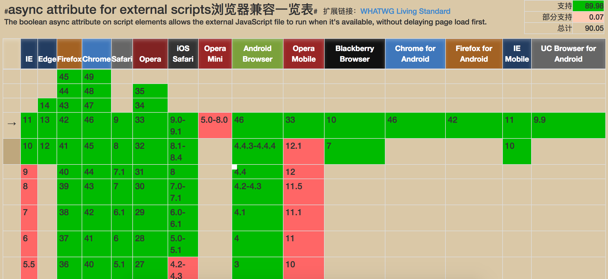

<h3>1、async函数简介</h3>

<h4>1.1、前注</h4>

在阅读本章节之前，建议先阅读 [【Generator函数】](http://blog.csdn.net/qq20004604/article/details/77461069)章节和[【Thunk函数】](http://blog.csdn.net/qq20004604/article/details/77555279)章节。

不然很有可能对本章节内容摸不着头脑，或者理解有所偏差。

这里假定你已经对以上知识有所理解，不考虑完全不懂的人能否理解本博文。

<h4>1.2、兼容性</h4>

关于asnyc函数的兼容性：[Can I use网站的说明](https://caniuse.com/#search=async)

简单来说：支持async的有：IE11、Edge、58+的chrome、54+的火狐、10.1+的Safari。以下版本的基本都不支持。



<h4>1.3、是什么</h4>

他是Generator函数的语法糖，但相较来说比Generator函数更强大一些。

主要用于解决依次异步调用异步函数的问题。

即当第一个异步调用结束后，再调用第二个异步函数；等第二个调用完成后再调用第三个的这种情况。

在以往的写法里，需要进行回调函数多层嵌套才能实现，但这种写法会导致多层回调函数嵌套，形成可怕的回调地狱，既不方便维护，也不方便理解。

而新的写法可以解决以上这些问题，让原本的回调地狱，变成类似同步函数一样的写法。极大的减轻了代码的复杂度。

在async函数出来之前，解决这类问题如果不想用面对回调地狱，那么一般是借用Gererator函数，然后使用Thunk函数或者Co模块。

二者实质上是类似的。

<h4>1.4、async函数示例</h4>

```
function delay(dealCallback) {
    return new Promise((resolve, reject) => {
        setTimeout(function () {
            dealCallback()
            resolve(123)
        }, 1000)
    })
}

const byPromise = function (fn) {
    return function (...args) {
        return fn.call(this, ...args)
    }
}

async function G() {
    let r1 = await byPromise(delay)(function () {
        console.log('first')
    })
    console.log(r1)
    let r2 = await 'abc'
    return r2
}
let foo = G()
foo.then(data => console.log(data))
// first
// 123
// abc
```

<h4>1.5、解释和说明</h4>

1、首先，async函数相对于Generator函数的区别有几点：

①函数名没有了星号(\*)，取而代之是async关键字；<br>
②函数内没有了yield表达式，取而代之的是await关键字；<br>
③执行的时候不再返回遍历器，手动执行next方法来一步步执行；而是调用函数时，即时自动执行；<br>
④await后面除了可以跟Promise对象后，还可以跟原始类型的值。但是**不能跟Thunk函数**，而Co模块在4.0之前是支持yield表达式后面跟Thunk函数的；<br>
⑤返回值是Promise对象；

2、除此之外，其他方面跟Generator函数比较相近；

3、async关键字是标明这个函数不是一般的函数，而是Generator函数（并且是有自动流程管理的）；

4、await类似yield表达式，要求后面跟的是一个Promise对象，或者基本类型（基本类型则视为同步）；

5、async和await是成套出现的，单纯只有一个是没有用的；

6、await只能在async函数内，而不能在其他函数内（即使另外一个函数在async的函数内也不行）；

7、await表达式的返回值，就是Promise对象传给resolve的值；

8、假如Promise对象执行了reject，那么会抛错一个错误来。

9、当第一个await表达式后面跟的Promise对象执行完毕之后（状态变成resolved）第二个才会继续执行。

10、async函数的返回的是一个Promise对象，他的值是async函数中，return返回的值。

<h4>1.6、async的几种写法</h4>

这里的写法不是函数内的写法，而是函数本身的写法：

①函数声明（声明式）：

async在function前

```
async function foo() {
    // some code...
}
```

②函数表达式（赋值式）：

async在function前

```
let foo = async function () {
    // some code...
}
```

③对象属性（属性式）：

async在function前

```
let foo = {
    bar: async function () {
        // some code...
    }
}
```

④对象属性简写：

async在函数名前

```
let foo = {
    async bar () {
        // some code...
    }
}
```

⑤箭头函数：

```
let foo = async () => {
    // some code...
}
```

⑥Class写法：

记得先new一个实例才能用

```
class Foo {
    async bar() {
        // some code...
    }
}
```

<h3>2、错误捕获</h3>

<h4>2.1、async函数抛错</h4>

async函数内部的抛错，会使async函数返回的Promise对象的状态变为rejected，并使函数立即结束（不再执行抛错代码之后的代码）。

假如async函数没有错误捕获机制，或者返回的Promise对象没有例如catch之类的错误处理机制，就会导致报错冒泡到外面来。

虽然由于Promise对象本身是异步的原因，在全部代码执行完后错误才会被抛出来，不会影响其他代码的执行（一般不会）。但这显然是不好的。

如代码：

```
async function Foo() {
    throw new Error("error")
    console.log('123')
}
Foo()
console.log("456")
// 456
// Uncaught (in promise) Error: error
// 错误是红字
```

解决办法有两个，通过返回对象的catch来处理错误，或者是在async内通过``try...catch``来捕获错误。

方法一（ctach）：

```
async function Foo() {
    throw new Error("error")
    console.log('123')
}
Foo().catch(error => {
    console.log("catch the error")
})
// catch the error
```

方法二（try...catch）：

```
async function Foo() {
    try {
        throw new Error("error")
        console.log('123')
    } catch (err) {
        console.log("catch the error")
    }
}
Foo()
// catch the error
```

<h4>2.2、await表达式报错</h4>

await表达式我们可以通常认为是一个Promise对象（即使不是，也会被隐式转换为Promise对象）。

而Promise对象报错有两种情况：

①在Promise对象内部报错；

②在Promise对象内部的异步执行区域报错；

如示例代码：

```
new Promise((resolve, reject) => {
    throw new Error("out error")    // 情况一
    setTimeout(function () {
        throw new Error("in error") // 情况二
        resolve()
    }, 1000)
})
```

情况一的报错是可以被捕获到的，但是情况二的不行。

先来一个简单的示例：

```
function delay(isOut) {
    return new Promise((resolve, reject) => {
        if (isOut) {
            throw new Error("out error")    // 情况一
        }
        setTimeout(function () {
            if (!isOut) {
                throw new Error("in error") // 情况二
            }
            resolve()
        }, 1000)
    })
}

const byPromise = function (fn) {
    return function (...args) {
        return fn.call(this, ...args)
    }
}

async function Foo() {
    try {
        await byPromise(delay)(true)
    } catch (err) {
        console.log(err)
    }
    try {
        await byPromise(delay)(false).catch(err => {
            console.log(err)
        })
    } catch (err) {
        console.log(err)
    }

}
Foo().catch(err => {
    console.log(err)
})
// Error: out error  白字错误
// Uncaught Error: in error     红字错误
```

白字错误说明是被捕获到了，而红字的错误说明没有被捕获到。

由此可以证明：

1. 无论是async函数内部的``try...catch``；
2. 错误所在的Promise对象的catch；
3. async函数返回的Promise对象的catch；

都是无法捕获到红字错误的。

而上面三个方法，都可以捕获到白字错误（按照上面的2>1>3的顺序，择先捕获）。


因此需要注意对于异步返回结果的处理，如果报错，那么应让该Promise对象执行reject方法，避免错误冒泡到外面来。

当执行了reject后，就可以被catch或者``try...catch``或者async返回的Promise的对象的catch方法捕获了。