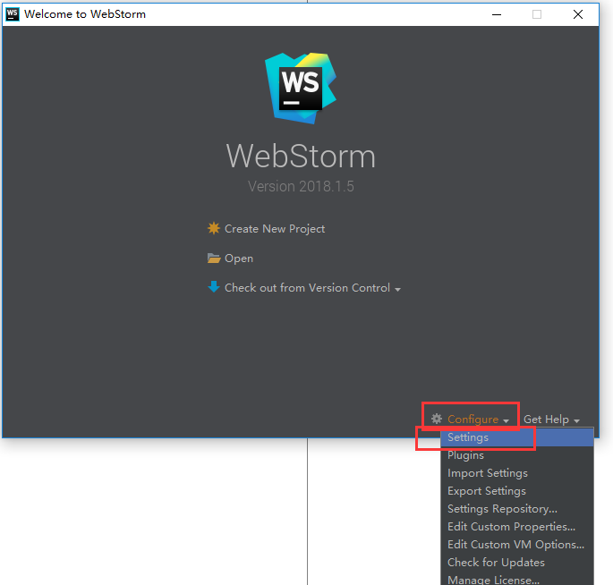
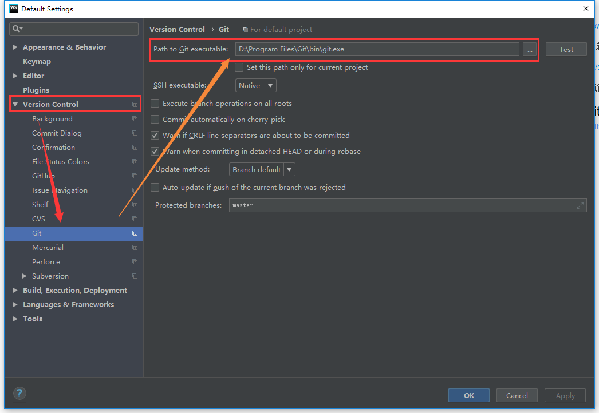
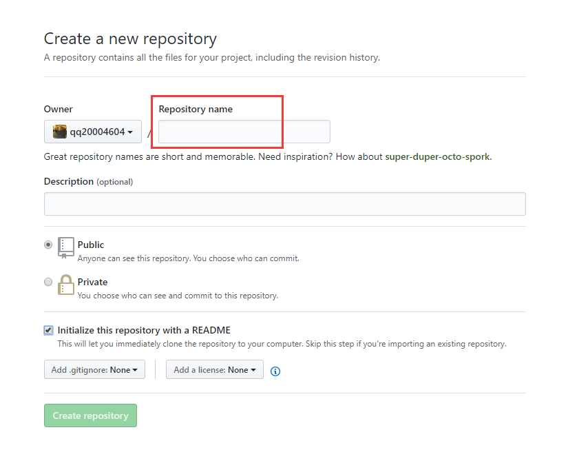
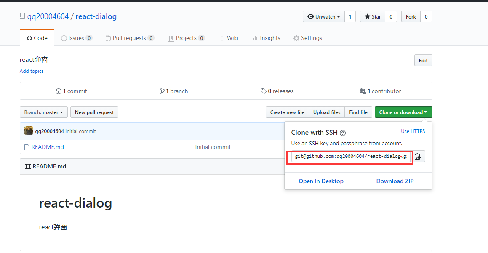
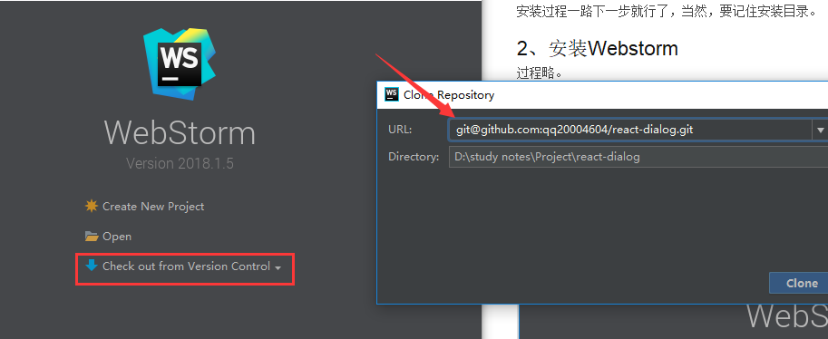
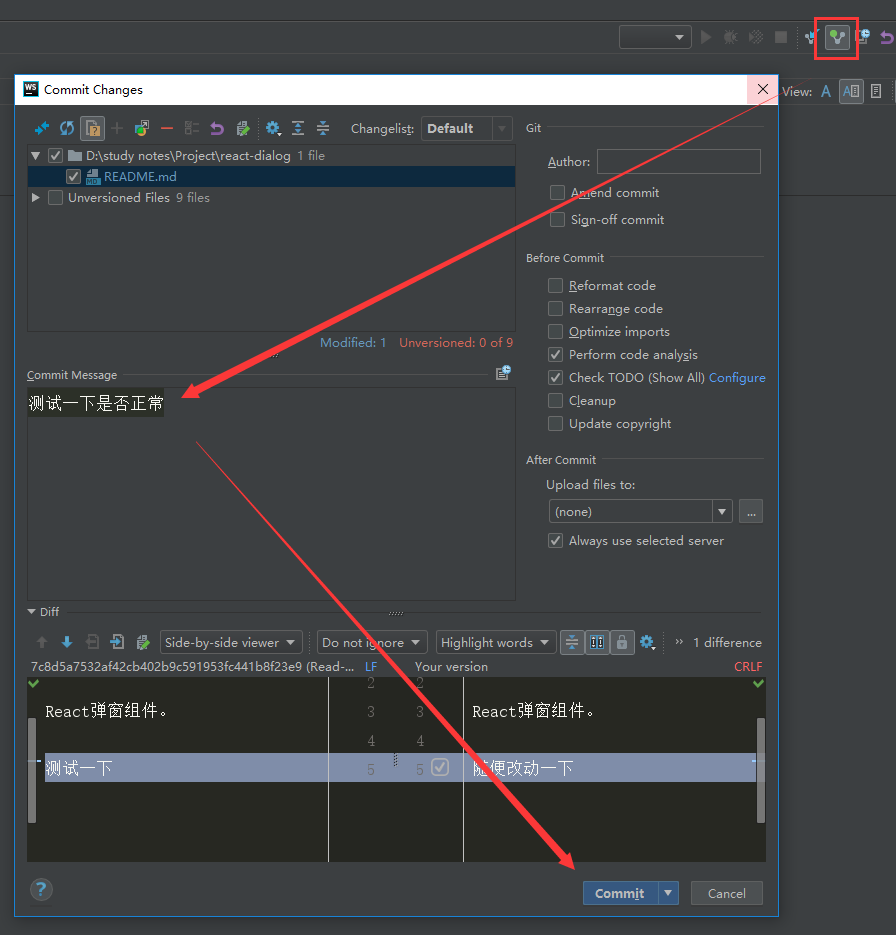

# 如何在github上上传项目

## 1、下载git

下载链接：

https://git-scm.com/download/win

墙外，可能下载速度比较慢，所以我再提供一个百度云盘的下载链接：

https://pan.baidu.com/s/1YA7-g__IZaLyxzpVC6oWLg

安装过程一路下一步就行了，当然，要记住安装目录。

## 2、安装Webstorm

过程略。

## 3、配置webstorm

初次打开webstorm，在这个页面上点击settings



然后配置git路径



另外，不要关闭，在左侧选择 github，然后填写你的账号密码，再点击确认。

## 4、注册一个github账号

github链接：https://github.com/ ，注册账号过程略（如果真的这么笨，建议你还是别用了）


## 5、创建一个项目

登录github，访问这个链接，创建一个项目

https://github.com/new

参照下图，红框是项目名，自行填写，注意需要是英文的。

除了owner默认，项目名自己填，其他跟我保持一致就行了



## 6、配对私钥

参考这个链接的4-6步：https://zhuanlan.zhihu.com/p/25569746

简单来说，

1. 先从 git bash 输入命令
2. 然后在提示的目录里找到 id_rsa.pub 文件
3. 再用记事本打开它，复制里面的内容
4. 打开github的私钥配置页面：https://github.com/settings/keys
5. 点击 new SSH key，在新页面将复制的内容丢进去
6. ok


## 7、fork到本地

进入刚创建的项目首页，复制红框处的链接。（注意，这一步有 SSH 和 https 两种。如果只是fork，建议点击一下Use HTTPS，使用 HTTPS方式来fork，如果要上传的话，还是使用HTTPS）。



返回webstorm选择项目的页面（如果已经进入webstorm，则左上角 File - Close Project 关闭当前项目）

再将之前复制的链接，点击红框，再选择Github（没有则选Git），出现弹窗，将链接复制到箭头指向的 URL。

然后点击 clone，复制好后打开。




如果报错：``Could not read from remote repository``. 这个报错的原因是私钥问题。


## 8、上传

随便改动一些什么，比如在readme.md 里打几个字。

参照下图，先webstorm右上角点击按钮，出弹窗，在箭头指的区域里填写提交信息（这次改动了什么），右下角点击 Commit 右边的箭头，会有一个 Commit and Push，选择之。




在新的窗口里直接点击push即可。

如果ok的话，webstorm 右下角会有提示，告诉你 push 成功了，并且 push过程中，webstorm 下方也有进度条的。


## 疑难杂症

### 1、明明生成 SSH 密钥了，还是提示错误

报错信息：

```
Push failed: Failed with error: Could not read from remote repository.
```


假如没生成SSH密钥，也没将这个密钥添加到 github，那么添加。如果已经添加了，还是报这个错误，请在 git bash 里输入以下两行命令（记得替换对应的字段，替换后的字段没有引号）

```
git config --global user.name "yourname"
git config --global user.email "youremail"
```

