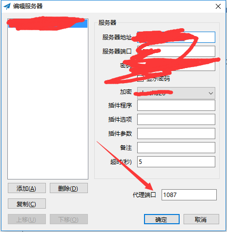
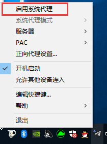
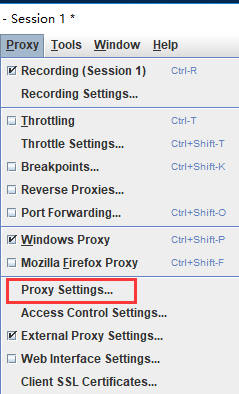
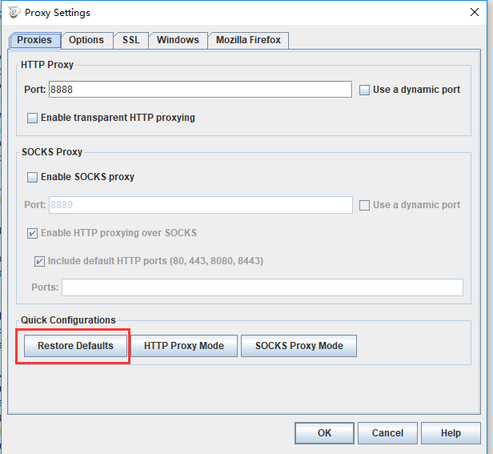
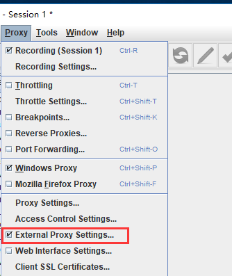

# 如何在windows环境下让Charles和shadowsocks共存

### 关键词：

Charles , Shadowsocks, Windows

### 默认设置下的问题：

1. 只打开 Charles ，可以正常代理；
2. 只打开 Shadowsocks ，可以使用谷歌；
3. 两个都打开（先开 Shadowsocks 后开 Charles ），在 Windows 环境下，要么无法使用谷歌，要么代理无效；

### 目标

系统流量先走 Charles ，然后 Charles 的流量走 Shadowsocks ，然后 Shadowsocks 实现上谷歌

### 解决办法：

1、正常使用 Shadowsocks ，配置服务器设置，将下方的代理端口改为 1087 ；

2、关闭 Shadowsocks 的系统代理，这一步是避免 Charles 和 Shadowsocks 同时去抢系统代理；

3、打开 Charles ，先配置 Proxy Settings ，参照下图红框处，具体配置直接改为默认配置即可。

4、再配置 External Proxy Settings ，让自己的配置和我图上的 **红框处** 保持一致。注意，Web Proxy 和 Secure Web Proxy 这两个都需要填一下，并且右边填的都是一致的。

5、完成。